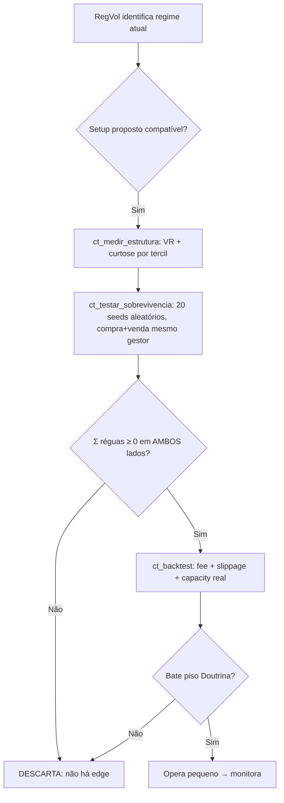

# CT Regime Volatility

---

## 1. O Que É

**CT RegVol** é um indicador de **medição de regime de volatilidade realizada** para TradingView (Pine Script v6).  
Não é um sinalizador de compra/venda. É uma **lente estatística** que responde:

> *"A volatilidade atual deste ativo está alta, baixa ou normal **relativa ao seu próprio histórico** — e esse regime está persistindo ou revertendo?"*

---

## 2. O Que Ele Faz (Entregáveis)

| Saída | Para Que Serve |
|-------|----------------|
| **Regime discreto** (Baixo / Normal / Alto / Extremo) via percentil histórico (p25/p75/p95) | Filtro de contexto: define *que tipo de setup* faz sentido agora |
| **Volatilidade normalizada (z-score robusto)** | Comparação cross-asset / cross-timeframe sem unidade |
| **Razão Curta/Longa (20/100 padrão)** | Detecção precoce de expansão (>1) ou contração (<1) de vol |
| **EWMA RiskMetrics (λ=0.94)** | Segunda opinião sobre clustering/persistência de vol |
| **Vol-of-Vol** | Alerta de instabilidade / transição de regime |
| **Sombreamento de fundo + tabela + alerts** | Leitura visual imediata + automação de vigilância |

---

## 3. O Que Ele NÃO Faz (Limites Declarados)

| Expectativa | Realidade |
|-------------|-----------|
| **Gerar sinais de entrada/saída** | Não. Regime ≠ direção. Vol alta pode acompanhar alta OU queda. |
| **Prever preço** | Não. Mede dispersão passada, não centro futuro. |
| **Substituir setup + gestão** | Não. É *input* de contexto para seu setup. |
| **Funcionar como ATR "melhorado"** | Não. ATR = range médio. RegVol = estrutura estatística de regime. |
| **Eliminar necessidade de backtest** | Não. Todo setup filtrado por regime **precisa** passar no teste de sobrevivência (lado arbitrário) e backtest com fee/slippage. |

---

## 4. Por Que Usar (Justificativa Metodológica)

| Componente | Escolha | Razão Estatística |
|------------|---------|-------------------|
| **Estimador** | Yang-Zhang (padrão) / Garman-Klass (opcional) | YZ: menor MSE entre estimadores OHLC não-paramétricos; incorpora gap overnight + ponderação ótima *k* (Yang & Zhang, 2000). GK: assume drift zero — melhor para crypto 24/7. |
| **Janelas 20/100** | Curta / Longa | 20 ≈ 1 mês pregão (responsivo); 100 ≈ 5 meses (linha de base estável). Razão adimensional detecta mudança de regime sem lag excessivo. |
| **Percentil histórico (252)** | Contexto adaptativo | Thresholds fixos (ex.: "ATR > 2%") falham cross-asset. Percentil p25/p75/p95 do **próprio ativo** = regime relativo, não absoluto. |
| **EWMA λ=0.94** | Persistência | Padrão RiskMetrics; meia-vida ~11 barras. Documentado: **não é GARCH(1,1)** (exige MLE). Serve como "2ª opinião" de clustering. |
| **Z-score robusto (IQR/1.35)** | Normalização | Resistente a outliers (crashes/spikes). Mediana + IQR > média + σ para vol. |

---

## 5. Quando Usar (Casos de Uso)

| Cenário | Como Aplicar |
|---------|--------------|
| **Selecionar estratégia do dia** | Regime BAIXO → breakout / mean-rev (se VR<1); NORMAL → trend-follow/pullback; ALTO/EXTREMO → reduce size, widen stops, hedge |
| **Filtro de universe** | Varredura multi-ativo: só opera ativos em regime NORMAL/BAIXO com VR favorável ao setup |
| **Gestão de risco de portfólio** | Regime EXTREMO em >30% do portfolio → hedge sistemático / redução de alavancagem |
| **Diagnóstico de drawdown** | "Por que meu setup falhou?" → Verifica se regime mudou contra a hipótese (ex.: mean-rev em vol alta persistente VR>1) |
| **Sizing adaptativo** | Position size ∝ 1 / vol_normalizada (ex.: Kelly fracionário escalado por z-score) |

---

## 6. Quando NÃO Usar (Contraindicações)

| Situação | Por Que Falha |
|----------|---------------|
| **Ativos ilíquidos / low-cap** | Prints espúrios inflandam overnight return (YZ) e EWMA |
| **Timeframes < 5m** | Microestrutura (bid-ask bounce) domina; OHLC vol perde eficiência |
| **IPO / listing novo (< 252 barras)** | Percentil instável — ruído, não sinal |
| **Como único input de decisão** | Category error: contexto ≠ decisão |
| **Esperar "reversão ao z-score"** | Vol não é mean-reverting como preço; z-score alto = regime alto, não "sobrecomprado" |

---

## 7. Pipeline de Validação Obrigatório (Doutrina CT)



**Regra de Ouro:** Se o setup não passa no teste do lado arbitrário (compra e venda em momentos aleatórios com mesmo gestor adaptativo → soma das réguas ≥ 0), **não há edge** — independente do regime.

---

## 8. Parâmetros Padrão & Racional

| Parâmetro | Padrão | Quando Ajustar |
|-----------|--------|----------------|
| **Estimador** | Yang-Zhang | Garman-Klass para crypto 24/7 contínuo (perp/spot) |
| **Janela Curta** | 20 | Scalping: 10-15; Swing: 30-50 |
| **Janela Longa** | 100 | Curta prazo: 50; Longo prazo: 200 |
| **Fator Anualização** | 252 | 365 (crypto spot), 52 (semanal), 12 (mensal) |
| **Janela Histórica** | 252 | Ativos novos: 500+; Crypto 24/7: 365-720 |
| **Limiares %** | 25 / 75 / 95 | Mais conservador: 20/80/90; Mais sensível: 30/70/95 |
| **λ EWMA** | 0.94 | Intraday alta freq: 0.97; Semanal: 0.90 |
| **Vol-of-Vol Janela** | 50 | Ruído alto: 100; Sensibilidade: 30 |

---

## 9. Interpretação Rápida (Cheat Sheet)

| Visual | Leitura | Ação Típica |
|--------|---------|-------------|
| 🟢 **Fundo verde** (pct < 25) | Compressão / vol baixa | Preparar breakout; mean-rev SÓ se VR<1 em vol alta |
| ⚪ **Fundo cinza** (25-75) | Negócio usual | Setups padrão; trend-follow preferido |
| 🟠 **Fundo laranja** (75-95) | Expansão confirmada | Trend-follow com stops largos; reduce size 30-50% |
| 🔴 **Fundo vermelho** (>95) | Cauda / crise / euforia | Hedge / proteção; zero fade; gestão de portfólio |
| **Razão > 1.2** | Vol expandindo rápido | Confirma transição → aguarda pullback para entrar |
| **Razão < 0.8** | Vol contraindo | Fim de regime → prepara nova compressão |
| **Vol-of-Vol spike** | Instabilidade | Transição em curso → cautela em sinais novos |
| **EWMA > Vol Curta** | Clustering persistente | Vol não "desliga" rápido → stops mais largos |

---

## 10. Código Fonte Completo (Pine Script v6)

```pinescript
//@version=6
indicator(
     "CT Regime Volatility",
     shorttitle = "CT RegVol",
     overlay = false,
     max_bars_back = 3000
)

// ─────────────────────────────────────────────────────────────────────────────
// INPUTS
// ─────────────────────────────────────────────────────────────────────────────

// Estimador de volatilidade realizada
grp_est = "Estimador de Volatilidade Realizada"

est_type = input.string(
     "Yang-Zhang",
     "Estimador",
     options = ["Yang-Zhang", "Garman-Klass"],
     group = grp_est,
     tooltip = "Yang-Zhang: usa gap overnight + ponderação ótima. Garman-Klass: assume drift zero."
)

win_short = input.int(
     20,
     "Janela Curta (vol atual)",
     minval = 5,
     maxval = 200,
     group = grp_est
)

win_long = input.int(
     100,
     "Janela Longa (linha de base)",
     minval = 20,
     maxval = 500,
     group = grp_est
)

ann_factor = input.float(
     252.0,
     "Fator Anualização",
     minval = 1.0,
     step = 1.0,
     group = grp_est,
     tooltip = "252 diário, 365 crypto spot, 52 semanal, 12 mensal."
)

// Contexto histórico / regime
grp_hist = "Contextualização Histórica (Regime)"

win_hist = input.int(
     252,
     "Janela Histórica (percentil)",
     minval = 50,
     maxval = 2000,
     group = grp_hist
)

pct_low = input.int(
     25,
     "Limiar Baixo (percentil)",
     minval = 1,
     maxval = 49,
     group = grp_hist
)

pct_high = input.int(
     75,
     "Limiar Alto (percentil)",
     minval = 51,
     maxval = 99,
     group = grp_hist
)

pct_ext = input.int(
     95,
     "Limiar Extremo (percentil)",
     minval = 90,
     maxval = 99,
     group = grp_hist
)

// EWMA
grp_ewma = "Persistência — EWMA (RiskMetrics-style)"

use_ewma = input.bool(
     true,
     "Ativar EWMA",
     group = grp_ewma
)

lambda = input.float(
     0.94,
     "λ (lambda)",
     minval = 0.80,
     maxval = 0.99,
     step = 0.01,
     group = grp_ewma,
     tooltip = "0.94 é o padrão RiskMetrics diário. Maior = mais memória."
)

ewma_init = input.int(
     30,
     "Barras p/ inicializar EWMA",
     minval = 10,
     maxval = 200,
     group = grp_ewma
)

// Vol-of-Vol
grp_vov = "Vol-of-Vol (Instabilidade de Regime)"

use_vov = input.bool(
     true,
     "Calcular Vol-of-Vol",
     group = grp_vov
)

win_vov = input.int(
     50,
     "Janela Vol-of-Vol",
     minval = 10,
     maxval = 200,
     group = grp_vov
)

// Visualização
grp_vis = "Visualização & Alertas"

show_bg = input.bool(
     true,
     "Sombreamento de fundo por regime",
     group = grp_vis
)

show_line = input.bool(
     true,
     "Linha Vol Normalizada (z-score)",
     group = grp_vis
)

show_ref = input.bool(
     true,
     "Linha de referência (mediana histórica)",
     group = grp_vis
)

show_ratio = input.bool(
     true,
     "Razão Curta/Longa",
     group = grp_vis
)

show_vov = input.bool(
     false,
     "Linha Vol-of-Vol",
     group = grp_vis
)

alert_reg = input.bool(
     true,
     "Alertas em mudança de regime",
     group = grp_vis
)

// ─────────────────────────────────────────────────────────────────────────────
// FUNÇÕES AUXILIARES
// ─────────────────────────────────────────────────────────────────────────────

// Garman-Klass por barra
garman_klass_var() =>
    hl = math.log(high / low)
    co = math.log(close / open)
    0.5 * hl * hl - (2.0 * math.log(2.0) - 1.0) * co * co

// Rogers-Satchell por barra
rogers_satchell_var() =>
    hc = math.log(high / close)
    ho = math.log(high / open)
    lc = math.log(low / close)
    lo = math.log(low / open)
    hc * ho + lc * lo

// Variância Yang-Zhang
//
// σ²YZ = σ²overnight
//      + k × σ²open-to-close
//      + (1 - k) × σ²RS
//
// O componente open-to-close é a variância dos retornos
// log(close / open), não Garman-Klass.
yang_zhang_var(window) =>
    overnight_ret = math.log(open / close[1])
    open_close_ret = math.log(close / open)

    var_overnight = ta.variance(overnight_ret, window)
    var_open_close = ta.variance(open_close_ret, window)
    var_rs = ta.sma(rogers_satchell_var(), window)

    k = 0.34 / (1.34 + (window + 1.0) / (window - 1.0))

    var_overnight + k * var_open_close + (1.0 - k) * var_rs

// Variância realizada
realized_var(window) =>
    est_type == "Yang-Zhang" ?
         yang_zhang_var(window) :
         ta.sma(garman_klass_var(), window)

// ─────────────────────────────────────────────────────────────────────────────
// CÁLCULOS PRINCIPAIS
// ─────────────────────────────────────────────────────────────────────────────

realized_var_short = realized_var(win_short)
realized_var_long = realized_var(win_long)

vol_short = realized_var_short >= 0 ?
     math.sqrt(realized_var_short) * math.sqrt(ann_factor) :
     na

vol_long = realized_var_long >= 0 ?
     math.sqrt(realized_var_long) * math.sqrt(ann_factor) :
     na

vol_ratio =
     not na(vol_short) and
     not na(vol_long) and
     vol_long > 0 ?
     vol_short / vol_long :
     na

// ─────────────────────────────────────────────────────────────────────────────
// EWMA
// σ²t = λ × σ²t-1 + (1 - λ) × r²t-1
// ─────────────────────────────────────────────────────────────────────────────

r_cc = math.log(close / close[1])

var float var_ewma = na

if use_ewma
    if bar_index < ewma_init
        var_ewma := na
    else if bar_index == ewma_init
        var_ewma := ta.variance(r_cc, ewma_init)
    else
        var_ewma := lambda * nz(var_ewma[1]) + (1.0 - lambda) * nz(r_cc[1]) * nz(r_cc[1])
else
    var_ewma := na

vol_ewma =
     use_ewma and
     not na(var_ewma) and
     var_ewma >= 0 ?
     math.sqrt(var_ewma) * math.sqrt(ann_factor) :
     na

// ─────────────────────────────────────────────────────────────────────────────
// CONTEXTUALIZAÇÃO HISTÓRICA
// ─────────────────────────────────────────────────────────────────────────────

pct_rank = ta.percentrank(vol_short, win_hist)

med_hist = ta.median(vol_short, win_hist)

q75 = ta.percentile_nearest_rank(vol_short, win_hist, 75)
q25 = ta.percentile_nearest_rank(vol_short, win_hist, 25)

iqr = q75 - q25

robust_scale = iqr / 1.35

z_score =
     not na(vol_short) and
     not na(med_hist) and
     not na(robust_scale) and
     robust_scale > 0 ?
     (vol_short - med_hist) / robust_scale :
     na

ewma_z =
     not na(vol_ewma) and
     not na(med_hist) and
     not na(robust_scale) and
     robust_scale > 0 ?
     (vol_ewma - med_hist) / robust_scale :
     na

// ─────────────────────────────────────────────────────────────────────────────
// CLASSIFICAÇÃO DE REGIME
// ─────────────────────────────────────────────────────────────────────────────
//
// 0 = Baixo
// 1 = Normal
// 2 = Alto
// 3 = Extremo

int regime = na

if not na(pct_rank)
    regime :=
         pct_rank < pct_low ? 0 :
         pct_rank < pct_high ? 1 :
         pct_rank < pct_ext ? 2 :
         3

regime_str =
     regime == 0 ? "BAIXO" :
     regime == 1 ? "NORMAL" :
     regime == 2 ? "ALTO" :
     regime == 3 ? "EXTREMO" :
     "SEM DADOS"

bg_color =
     regime == 0 ? color.new(color.green, 90) :
     regime == 1 ? color.new(color.gray, 95) :
     regime == 2 ? color.new(color.orange, 85) :
     regime == 3 ? color.new(color.red, 80) :
     na

// ─────────────────────────────────────────────────────────────────────────────
// VOL-OF-VOL
// ─────────────────────────────────────────────────────────────────────────────

vol_of_vol =
     use_vov ?
     ta.stdev(vol_short, win_vov) :
     na

// ─────────────────────────────────────────────────────────────────────────────
// ALERTAS
//
// alertcondition exige mensagem constante.
// Valores dinâmicos podem ser obtidos via {{plot("Nome")}}.
// ─────────────────────────────────────────────────────────────────────────────

regime_changed =
     not na(regime) and
     not na(regime[1]) and
     regime != regime[1]

enter_high =
     alert_reg and
     regime_changed and
     (regime == 2 or regime == 3)

enter_low =
     alert_reg and
     regime_changed and
     regime == 0

alertcondition(
     enter_high,
     title = "Entrada Regime ALTO/EXTREMO",
     message = "CT RegVol: regime entrou em ALTO ou EXTREMO."
)

alertcondition(
     enter_low,
     title = "Entrada Regime BAIXO",
     message = "CT RegVol: regime entrou em BAIXO."
)

// ─────────────────────────────────────────────────────────────────────────────
// VISUALIZAÇÃO
// ─────────────────────────────────────────────────────────────────────────────

bgcolor(
     show_bg ? bg_color : na,
     title = "Regime Background"
)

plot(
     show_line ? z_score : na,
     title = "Vol Normalizada (z-score)",
     color = color.blue,
     linewidth = 2
)

plot(
     show_ref ? 0.0 : na,
     title = "Mediana Histórica (ref)",
     color = color.new(color.gray, 40),
     linewidth = 1
)

plot(
     show_ratio ? vol_ratio : na,
     title = "Razão Curta/Longa",
     color = color.purple,
     linewidth = 1
)

plot(
     use_ewma and show_line ? ewma_z : na,
     title = "EWMA Vol (z-score)",
     color = color.new(color.teal, 20),
     linewidth = 1,
     style = plot.style_stepline
)

plot(
     show_vov ? vol_of_vol : na,
     title = "Vol-of-Vol",
     color = color.maroon,
     linewidth = 1
)

// ─────────────────────────────────────────────────────────────────────────────
// TABELA DE STATUS — VISUAL MELHORADO
// ─────────────────────────────────────────────────────────────────────────────

var table status_tbl = table.new(
     position.top_right,
     2,
     7,
     bgcolor = color.new(color.black, 10),
     border_color = color.new(color.gray, 30),
     border_width = 2
)

if barstate.islast

    // Cabeçalho
    table.cell(
         status_tbl, 0, 0,
         "MÉTRICA",
         text_color = color.white,
         bgcolor = color.rgb(40, 40, 40),
         text_size = size.normal
    )

    table.cell(
         status_tbl, 1, 0,
         "VALOR",
         text_color = color.white,
         bgcolor = color.rgb(40, 40, 40),
         text_size = size.normal
    )

    // Linha 1 — Vol Curta
    table.cell(
         status_tbl, 0, 1,
         "Vol Curta",
         text_color = color.silver,
         bgcolor = color.new(color.black, 5),
         text_size = size.normal
    )

    table.cell(
         status_tbl, 1, 1,
         str.tostring(vol_short, "#.####"),
         text_color = color.white,
         bgcolor = color.new(color.black, 5),
         text_size = size.large
    )

    // Linha 2 — Vol Longa
    table.cell(
         status_tbl, 0, 2,
         "Vol Longa",
         text_color = color.silver,
         bgcolor = color.new(color.black, 15),
         text_size = size.normal
    )

    table.cell(
         status_tbl, 1, 2,
         str.tostring(vol_long, "#.####"),
         text_color = color.white,
         bgcolor = color.new(color.black, 15),
         text_size = size.large
    )

    // Linha 3 — Ratio
    table.cell(
         status_tbl, 0, 3,
         "Curta / Longa",
         text_color = color.silver,
         bgcolor = color.new(color.black, 5),
         text_size = size.normal
    )

    table.cell(
         status_tbl, 1, 3,
         str.tostring(vol_ratio, "#.##"),
         text_color = color.white,
         bgcolor = color.new(color.black, 5),
         text_size = size.large
    )

    // Linha 4 — Percentil
    table.cell(
         status_tbl, 0, 4,
         "Percentil",
         text_color = color.silver,
         bgcolor = color.new(color.black, 15),
         text_size = size.normal
    )

    table.cell(
         status_tbl, 1, 4,
         str.tostring(pct_rank, "#") + "%",
         text_color = color.white,
         bgcolor = color.new(color.black, 15),
         text_size = size.large
    )

    // Linha 5 — Regime
    table.cell(
         status_tbl, 0, 5,
         "REGIME",
         text_color = color.white,
         bgcolor = color.rgb(40, 40, 40),
         text_size = size.normal
    )

    table.cell(
         status_tbl, 1, 5,
         regime_str,
         text_color = color.white,
         bgcolor =
             regime == 0 ? color.rgb(25, 110, 55) :
             regime == 1 ? color.rgb(75, 75, 75) :
             regime == 2 ? color.rgb(160, 95, 0) :
             regime == 3 ? color.rgb(170, 30, 30) :
             color.rgb(60, 60, 60),
         text_size = size.large
    )

    // Linha 6 — Z-Score
    table.cell(
         status_tbl, 0, 6,
         "Z-Score",
         text_color = color.silver,
         bgcolor = color.new(color.black, 5),
         text_size = size.normal
    )

    table.cell(
         status_tbl, 1, 6,
         str.tostring(z_score, "#.##"),
         text_color = color.white,
         bgcolor = color.new(color.black, 5),
         text_size = size.large
    )
```

---

## 11. Limitações Conhecidas (Resumo Técnico)

| Limitação | Detalhe | Mitigação |
|-----------|---------|-----------|
| **Gap overnight em ações** | YZ captura; GK ignora | Use YZ obrigatório em ativos com sessão |
| **Crypto low-cap / ilíquido** | Prints espúrios → variância inflada | Filtre volume mínimo; prefira GK |
| **Timeframe < 5m** | Microestrutura domina | Agregue timeframe ou use vol baseada em trades |
| **EWMA ≠ GARCH** | λ fixo ≠ ω,α,β estimados | Use como 2ª opinião, não modelo gerativo |
| **Percentil precisa histórico** | win_hist=252 → ~252 barras p/ estabilizar | Em ativos novos: aumente win_hist ou aceite ruído |
| **Percentile_nearest_rank custo** | Pode travar em win_hist>500 | Reduza win_hist ou use aproximação linear |
| **Anualização** | Fator errado escala valor absoluto | Ratio e z-score são adimensionais — independem do fator |

---

## 12. Próximos Passos Recomendados

1. **Adicione ao gráfico** → ajuste `ann_factor` (252/365/52) e `est_type` (YZ/GK)
2. **Observe 2-3 ciclos** de regime (baixo→normal→alto→baixo) no seu ativo/timeframe
3. **Defina hipótese de setup** condicional a regime (ex.: "pullback EMA21 só em regime NORMAL com VR>1")
4. **Rode validação completa**: `ct_medir_estrutura` → `ct_testar_sobrevivencia` → `ct_backtest`
5. **Só então** opere com capital real — começando pequeno

---

> **Doutrina CT:** *"Ferramenta mede o passado. Decisão é sua. Sobrevivência antes de edge."*  
> Este indicador é a **ferramenta de medição**. A **decisão** — setup, gestão, risco — permanece 100% sua.

---

> **Disclaimer:** This content was created with the assistance of generative artificial intelligence. It is the creative material of the author and does not reflect the opinion, position, or endorsement of verida.trade or CT Lab. Not financial advice. verida.trade does not provide investment recommendations, portfolio management, or brokerage services. No predictions or guarantees of future results. Backtests and indicators reflect historical data and do not guarantee future performance. All trading and investment decisions are made solely by the user, who assumes full responsibility for all risks, including potential loss of capital. This material is intended for educational and research purposes only. Before making any financial decision, consult a licensed professional in your jurisdiction.

